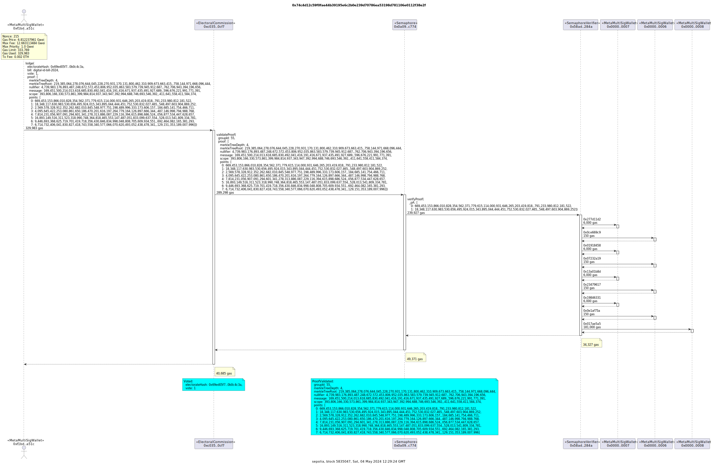

# 0xPoll

0xPoll allows an issuer to assign World IDs to groups so they can anonymously vote.
For the hackathon, we used the scenario of the Australian Electoral Commission (AEC) assigning World IDs to electorates so they can anonymously vote on proposed bills to be presented in parliament. This could be applied to other voting groups like DAOs.

# Contracts

## Sepolia

- ElectoralCommission [0xC0353182AC84ac8CF97e5724fb6964a6FA870CF7](https://sepolia.basescan.org/address/0xC0353182AC84ac8CF97e5724fb6964a6FA870CF7)
- ISemaphore [0x0A09FB3f63c13F1C54F2fA41AFB1e7a98cffc774](https://sepolia.basescan.org/address/0x0A09FB3f63c13F1C54F2fA41AFB1e7a98cffc774)
- WorldIDRouter [0x42FF98C4E85212a5D31358ACbFe76a621b50fC02](https://sepolia.basescan.org/address/0x42FF98C4E85212a5D31358ACbFe76a621b50fC02)

## Polygon zkEVM Cardona Testnet

- ElectoralCommission [0x75281fFc939bc0D013964954959793f760342B11](https://amoy.polygonscan.com/0x75281fFc939bc0D013964954959793f760342B11)
- ISemaphore N/A
- WorldIDRouter N/A

### Install

git clone this repo

```shell
git clone https://github.com/c4f3c0d3/0xpoll
cd 0xpoll
# Copy `.env.example` to `.env` and fill in the environment variables.
cp .env.example .env
```

### Build

```shell
$ forge build
```

## Deploy

```bash
make deploy
```

### Test/run

This script will add voters to an electorate and simulate voters lodging their vote by generating a zero-knowledge proof.

```bash
 node ./src/js/sempaphore.js
```

# Technology Stack

- Solidity for smart contracts
- Foundry (Forge) for building contracts
- Ethers.js for deploying and interacting with contracts
- Semaphore protocol for managing identities, groups and proofs

# Semaphore Protocol

Semaphore is a privacy-preserving protocol that allows users to prove membership in a group without revealing their identity. It is built on top of the Semaphore smart contract system, which is a set of smart contracts that allow users to create and manage groups, identities, and proofs.

- [What Is Semaphore?](https://docs.semaphore.pse.dev/)
- Guides:
  - [Identities](https://docs.semaphore.pse.dev/guides/identities)
  - [Groups](https://docs.semaphore.pse.dev/guides/groups)
  - [Proofs](https://docs.semaphore.pse.dev/guides/proofs)
- [Deployed contracts](https://docs.semaphore.pse.dev/deployed-contracts)

# Example transactions

## Add voter to an electorate

tx [0xbcc1645e8bf6b0e4203d93c3d4e73cd635caab1d1850f5f55928c799a4b8ae95](https://sepolia.etherscan.io/tx/0xbcc1645e8bf6b0e4203d93c3d4e73cd635caab1d1850f5f55928c799a4b8ae95)

```
tx2uml 0xbcc1645e8bf6b0e4203d93c3d4e73cd635caab1d1850f5f55928c799a4b8ae95 -x -v -c sepolia -e https://api-sepolia.etherscan.io/api -k ${ETHERSCAN_API_KEY} -u ${SEPOLIA_RPC_URL}
```


## Lodged Vote

tx [0x74c4d12c59f0fae44b39195e6c2b0e239d70786ea53198d781106e0112f38e2f](https://sepolia.etherscan.io/tx/0x74c4d12c59f0fae44b39195e6c2b0e239d70786ea53198d781106e0112f38e2f)

```
tx2uml 0x74c4d12c59f0fae44b39195e6c2b0e239d70786ea53198d781106e0112f38e2f -x -v -c sepolia -e https://api-sepolia.etherscan.io/api -k ${ETHERSCAN_API_KEY} -u ${SEPOLIA_RPC_URL}
```


