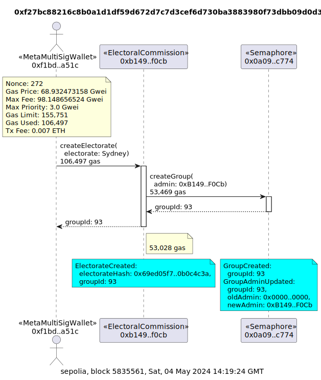
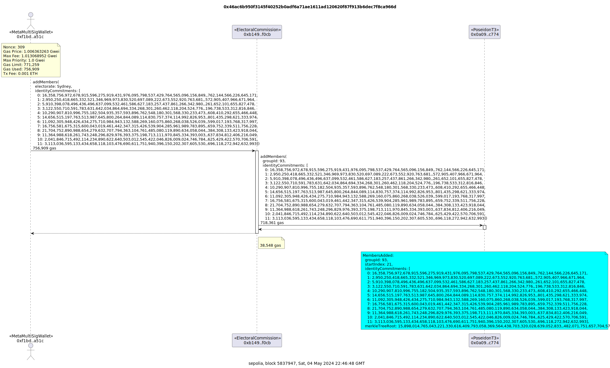

# 0xPoll

0xPoll allows an issuer to assign World IDs to groups so they can anonymously vote.
For the hackathon, we used the scenario of the Australian Electoral Commission (AEC) assigning World IDs to electorates so they can anonymously vote on proposed bills to be presented in parliament. This could be applied to other voting groups like DAOs.

# Contracts

## Sepolia

- ElectoralCommission [0xB149F77675e79810971609Fc0b87F6958481F0Cb](https://sepolia.etherscan.io/address/0xB149F77675e79810971609Fc0b87F6958481F0Cb)
- ISemaphore [0x0A09FB3f63c13F1C54F2fA41AFB1e7a98cffc774](https://sepolia.etherscan.io/address/0x0A09FB3f63c13F1C54F2fA41AFB1e7a98cffc774)
- WorldIDRouter [0x42FF98C4E85212a5D31358ACbFe76a621b50fC02](https://sepolia.etherscan.io/address/0x42FF98C4E85212a5D31358ACbFe76a621b50fC02)

## Polygon zkEVM Cardona Testnet

- ElectoralCommission [0x75281fFc939bc0D013964954959793f760342B11](https://amoy.polygonscan.com/0x75281fFc939bc0D013964954959793f760342B11)
- ISemaphore N/A
- WorldIDRouter N/A

## Base Sepolia

- ElectoralCommission [0xa3C235f09F1491fbc714efDAA7504089E49Df1b2](https://sepolia.basescan.org/address/0xa3C235f09F1491fbc714efDAA7504089E49Df1b2)
- ISemaphore N/A
- WorldIDRouter N/A

### Install

git clone this repo

```shell
git clone https://github.com/c4f3c0d3/0xpoll
cd 0xpoll
# Copy `.env.example` to `.env` and fill in the environment variables.
cp .env.example .env
```

### Build

```shell
$ forge build
```

## Deploy

Run the forge script `DeployElectoralCommission` in [script/ElectoralCommission.s.sol](./script/ElectoralCommission.s.sol)

```bash
make deploy
```

### Test/run

This script will add voters to an electorate and simulate voters lodging their vote by generating a zero-knowledge proof.

```bash
 node ./src/js/sempaphore.js
```

The script will add a voter to an electorate so the frontend can then lodge their vote.

```bash
 node ./src/js/addVoter.js
```

# Blockchain Technology Stack

- [World ID](https://worldcoin.org/world-id) for authenticating a real user
- [Semaphore protocol](https://semaphore.pse.dev/) for managing identities, groups and proofs
- [Ethers.js](https://docs.ethers.org/v6/) for deploying and interacting with contracts
- [Foundry's Forge](https://github.com/foundry-rs/foundry) for building contracts
- [Solidity](https://soliditylang.org/) for smart contracts

# Semaphore Protocol

Semaphore is a privacy-preserving protocol that allows users to prove membership in a group without revealing their identity. It is built on top of the Semaphore smart contract system, which is a set of smart contracts that allow users to create and manage groups, identities, and proofs.

- [What Is Semaphore?](https://docs.semaphore.pse.dev/)
- Guides:
  - [Identities](https://docs.semaphore.pse.dev/guides/identities)
  - [Groups](https://docs.semaphore.pse.dev/guides/groups)
  - [Proofs](https://docs.semaphore.pse.dev/guides/proofs)
- [Deployed contracts](https://docs.semaphore.pse.dev/deployed-contracts)

# Example transactions

## Add voter to an electorate

The identity issuer, which could be the Australian Electoral Commission or a trusted third party like the Post Office, adds an identity commitment to the Sydney electorate. The public key of the identity is not revealed.

tx [0x5c5a4fd217682c8c8e6dc51da5f2feb8ef112636c61c50945b3070a039cbd022](https://sepolia.etherscan.io/tx/0x5c5a4fd217682c8c8e6dc51da5f2feb8ef112636c61c50945b3070a039cbd022)

```
tx2uml 0x5c5a4fd217682c8c8e6dc51da5f2feb8ef112636c61c50945b3070a039cbd022 -x -v -c sepolia -e https://api-sepolia.etherscan.io/api -k ${ETHERSCAN_API_KEY} -u ${SEPOLIA_RPC_URL}
```


## Lodge Vote

A voter in the Sydney electorate lodges their Yes vote on the [Digital ID bill](https://www.digitalidentity.gov.au/digital-id-bill) in the federal parliament. The vote is an enum so Yes = 1.

Notice the electorate, bill and Yes vote is revealed along with a zero-knowledge proof, but not the identity of the voter. Semaphore also restricts the voter to only voting once even though the voter is not revealed in the on-chain transaction.

The VoteAdded event can be used to tally the votes.

Generating the proof takes around 1 second to construct in the browser.

The transaction used 331k gas. 289k of this was used to verify the zero-knowledge proof against the Semaphore contract.

tx [0xa4c3c034c08900172a438b0b094ec605991bf10eac9b1ca1ec90dbdb8f1b36eb](https://sepolia.etherscan.io/tx/0xa4c3c034c08900172a438b0b094ec605991bf10eac9b1ca1ec90dbdb8f1b36eb)

```
tx2uml 0xa4c3c034c08900172a438b0b094ec605991bf10eac9b1ca1ec90dbdb8f1b36eb -x -v -c sepolia -e https://api-sepolia.etherscan.io/api -k ${ETHERSCAN_API_KEY} -u ${SEPOLIA_RPC_URL}
```


## Create electorate

The identity issuer creates the Sydney electorate for the Federal Parliament. This creates a group in the semaphore contract with the `ElectorateCommission` contract as the administrator.

tx [0xf27bc88216c8b0a1d1df59d672d7c7d3cef6d730ba3883980f73dbb09d0d314e](https://sepolia.etherscan.io/tx/0xf27bc88216c8b0a1d1df59d672d7c7d3cef6d730ba3883980f73dbb09d0d314e)

```
tx2uml 0xf27bc88216c8b0a1d1df59d672d7c7d3cef6d730ba3883980f73dbb09d0d314e -x -v -c sepolia -e https://api-sepolia.etherscan.io/api -k ${ETHERSCAN_API_KEY} -u ${SEPOLIA_RPC_URL}
```



## Add multiple voters

The identity issuer, which could be the Australian Electoral Commission or a trusted third party like the Post Office, adds multiple identity commitments to the Sydney electorate. The public keys of the identities are not revealed.

tx [0x770f37f0edb03f3e61974fd3fedf04d91817b6a1596ba9c1a0042d30ede93c4a](https://sepolia.etherscan.io/tx/0x770f37f0edb03f3e61974fd3fedf04d91817b6a1596ba9c1a0042d30ede93c4a)

```
tx2uml 0x46ac6b950f3145f40252b0adf6a71ae1611ad120620f87f913b6dec7f8ca966d -x -v -c sepolia -e https://api-sepolia.etherscan.io/api -k ${ETHERSCAN_API_KEY} -u ${SEPOLIA_RPC_URL}
```


